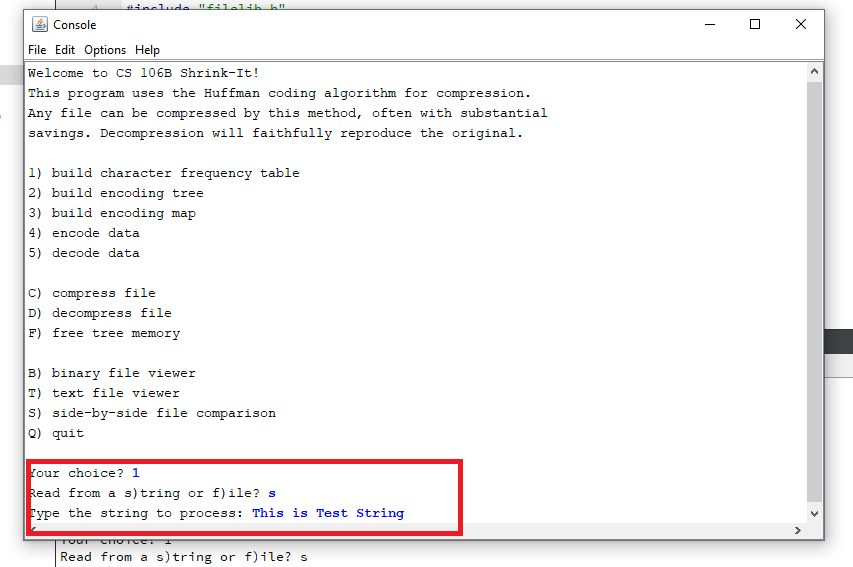

# Huffman
This project is one of the Assignment of CS 106B from stanford University.

Starter code and problem documentation can be found on the following website
https://web.stanford.edu/class/archive/cs/cs106b/cs106b.1186//assn/huffman.html

My Sollution Added on the follwoing file:

[encoding.cpp](https://github.com/Apurba000Biswas/Huffman/blob/master/src/encoding.cpp)

### Operation:
#### Step 01 : input a string to encode

  

