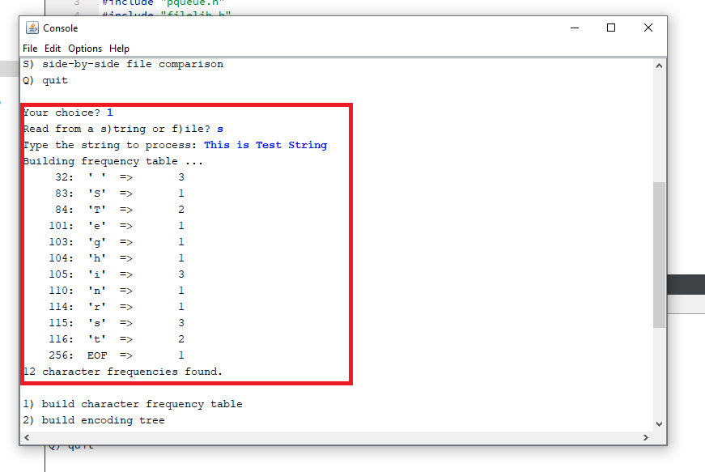

# Huffman
This project is one of the Assignment of CS 106B from stanford University.

Starter code and problem documentation can be found on the following website
https://web.stanford.edu/class/archive/cs/cs106b/cs106b.1186//assn/huffman.html

My Sollution Added on the follwoing file:

[encoding.cpp](https://github.com/Apurba000Biswas/Huffman/blob/master/src/encoding.cpp)

### Operation:
#### Step 01 : input a string to encode

  

#### Step 02 : Build a frequency table to count occurences for each character in the file/string

  

#### Step 03 : Build huffman/encoding tree

  

#### Step 04 : Build encoding map/ new language from the tree

  

#### Step 05 : Now encode the inputed string/file data

  

#### Step 06 : Now to decode the outputed binary data to verify

  

#### Overall compression

  

#### Overall decompression

  

#### Lets check the compression is working or not?

  

  

Ok its Working!!!

#### NOTE : If you are Stanford CS 106B Student, Please Dont See the Source code. If you do you will violate the HONOR CODE